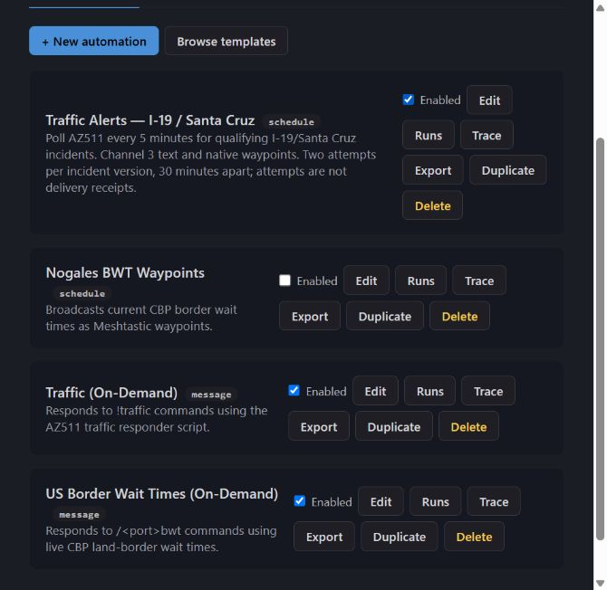

# MeshMonitor AZ511 Traffic

Arizona traffic alerts and road lookups for Meshtastic, using the ADOT AZ511 feed.

The recommended scheduled workflow uses MeshMonitor's native `action.broadcastWaypoint`: Python fetches and selects incidents, and MeshMonitor broadcasts their map pins and Traffic-channel text. The separate `!traffic` responder provides on-demand reports.

**Current deployment:** MeshMonitor **4.17.0-rc2** (original native feature audit against rc1), Docker on Raspberry Pi, October 2, 2026. The five-minute I-19/Santa Cruz timer is installed and enabled. A separate controlled test delivered both its TEST message and waypoint to a receiving app. Automatic delivery confirmation is unavailable in this release; the timer records bounded attempts.



## Start here

- [Obtain and install your ADOT API key](docs/GUIDE.md#obtain-and-install-the-adot-api-key)
- [Detailed installation and operating guide](docs/GUIDE.md)
- [Feature audit, test evidence, and known limitations](docs/FEATURES.md)
- [Disabled scheduled automation example](examples/traffic-scheduled.disabled.json)
- [On-demand automation example](examples/traffic-on-demand.disabled.json)
- [Manual live-test automation example](examples/traffic-test.disabled.json)

## What it does

| Workflow | Behavior |
| --- | --- |
| Scheduled alerts | Poll every five minutes; select new or changed high-impact events labeled I19/SCZ; up to three per cycle; native waypoint and Traffic text |
| Bounded retry | Offer an incident immediately and once more after at least 30 minutes; stop after two attempts for its current fingerprint |
| `!traffic` | Up to three Metro Phoenix freeway incidents/closures; this is **not** a Nogales digest |
| `!traffic I-19` | Up to three matching-road events across configured zones, including roadwork |
| Area lookups | `!traffic nogales`, `!traffic rio rico`, `!traffic santa cruz`; approximate area rectangles |
| Duplicate prevention | Only the selected receiving source triggers on-demand replies; all replies use that source |
| Scheduled hop limit | Waypoints and text inherit the selected radio configuration |
| Incident display | Classified emoji, normalized road, direction, zone tag, update time and Google Maps link |

Coverage uses rectangles, not a county boundary polygon. Overlapping zones can exclude northern I-19 from scheduled selection. See the [coverage audit](docs/FEATURES.md#known-limitations).

## Files and compatibility

| File | Purpose |
| --- | --- |
| `traffic_attempts.py` | Recommended native timer entry point; persists a separate attempt ledger |
| `traffic_native_data.py` | AZ511 filtering, classification, formatting, waypoint data and pure selection; no RF transport |
| `traffic_responder.py` | Existing text-only on-demand responder |
| `traffic_timer.py` | Deprecated compatibility module: re-exports native helpers for the responder; direct execution is silent and never transmits |
| `common.py` | Shared HTTP, text, state and output helpers |
| `examples/` | Disabled, portable automation examples; replace source placeholders before use |
| `tests/` | Synthetic feature audit; no live AZ511, RF or production state |

Install all five Python files together. The responder imports helpers through `traffic_timer.py`, which now re-exports them from `traffic_native_data.py`. The old Virtual Node transmitter has been removed. Executing the deprecated entry point prints an empty response and a deprecation warning; scheduled traffic uses the Automation Engine.

## Quick command reference

| Command | Information returned |
| --- | --- |
| `!traffic` | Metro Phoenix freeway incidents and closures |
| `!traffic nogales` | Reported events in the approximate Nogales area |
| `!traffic rio rico` | Reported events in the approximate Rio Rico area |
| `!traffic santa cruz` | Reported events in the Santa Cruz coverage rectangle |
| `!traffic <road>` | Recognized incidents, closures, roadwork and hazards matching a road within configured coverage |

Area aliases are case-insensitive: `riorico`, `rio-rico`, `rio_rico`; `santacruz`, `santa-cruz`, `santa_cruz`, `santa cruz county`, and `scz`.

Road queries are open-ended rather than a fixed command list. Examples:

| Road | Accepted examples |
| --- | --- |
| Interstate 19 | `!traffic I-19`, `!traffic I19`, `!traffic 19` |
| Interstate 10 | `!traffic I-10`, `!traffic I10`, `!traffic 10` |
| Interstate 17 | `!traffic I-17`, `!traffic I17`, `!traffic 17` |
| Interstate 40 | `!traffic I-40`, `!traffic I40`, `!traffic 40` |
| US 60 | `!traffic US-60`, `!traffic US60`, `!traffic 60` |
| State routes | `!traffic SR-82`, `!traffic SR-83`, `!traffic SR-87`, `!traffic SR-189`, `!traffic SR-347` (or the bare route number) |
| Loop routes | `!traffic L202`, `!traffic L-202`, `!traffic 202`; similarly `L101`/`101` and `L303`/`303` |

Replies contain up to three events: classified incident type, road/direction, zone tag, AZ511 update time and a Google Maps link. Results prioritize incidents, then closures, then roadwork, with newest updates first within each type. No-match replies describe the available AZ511 records, not independently verified road conditions. Travel times, speeds, cameras and weather are not supported.

Area boxes (latitude range, longitude range): Nogales 31.33–31.43, -111.02–-110.88; Rio Rico 31.43–31.65, -111.08–-110.88; Santa Cruz 31.33–31.80, -111.08–-110.43. These are approximate rectangles, not official jurisdiction boundaries. They filter records already inside the configured AZ511 coverage zones.

Use `L202` or `202` for Loop 202. The currently implemented matcher does **not** support `loop202`, despite the old script docstring suggesting it. Commands search configured feed coverage, not every Arizona road.

## Run the feature audit

From the repository root:

```bash
python3 -m unittest discover -s tests -v
```

The audit checks filters, all classifier rule groups, command parsing, responder priority, formatting, expiry, identity, attempts, overflow and scratch-ledger error handling. It also records known coverage and route-matching limitations rather than hiding them.

## Origin and attribution

Customized from the [Arizona Meshtastic Community traffic scripts](https://github.com/ArizonaMeshtasticCommunity/community-scripts/tree/main/traffic). The upstream project credits [Ted Malone's ADOT-511 project](https://github.com/temalo/ADOT-511). Retain these acknowledgments and consult the upstream repositories for applicable licensing terms.

Do not commit API keys, MeshMonitor tokens, production state, or Docker environment files.
