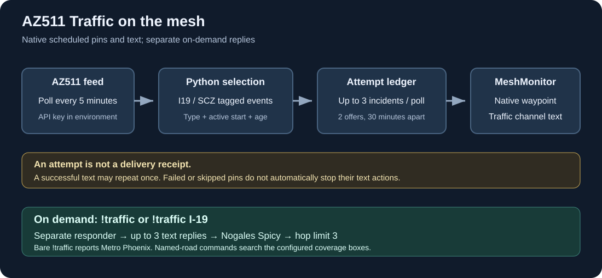
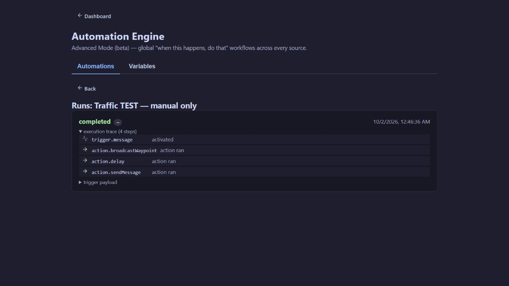

# Installation and operating guide

This guide describes the native scheduled workflow installed on October 2, 2026, plus the existing on-demand responder. Schema and behavior were checked against MeshMonitor **v4.17.0-rc1**. Later releases may offer different fields or delivery-result handling; use an export from your installed version when adapting the examples.

## Contents

1. [Architecture](#architecture)
2. [Prerequisites](#prerequisites)
3. [Install the scripts and ledger](#install-the-scripts-and-ledger)
4. [Configure the scheduled automation](#configure-the-scheduled-automation)
5. [Configure on-demand commands](#configure-on-demand-commands)
6. [Interpret messages and waypoints](#interpret-messages-and-waypoints)
7. [Configure coverage and lifetimes](#configure-coverage-and-lifetimes)
8. [Validate without transmitting](#validate-without-transmitting)
9. [Perform one controlled live test](#perform-one-controlled-live-test)
10. [Operate, troubleshoot and roll back](#operate-troubleshoot-and-roll-back)

## Architecture



The native timer runs `traffic_attempts.py`. It imports `traffic_native_data.py`, which fetches AZ511 and applies geographic, active-time, event-type and age filters. Up to three eligible incidents become named slots: `incident0`, `incident1`, and `incident2`.

MeshMonitor captures the output in a dedicated global JSON variable, `traffic_scheduled`. Each populated slot has a native waypoint action, five-second pause, and matching text action. Waypoints and messages use the same configured radio and channel.

The example has three branches. **The five-second pauses do not guarantee five seconds between every transmitted packet:** multiple waypoint branches may run before their text actions. This is a per-waypoint pause, not a serialized RF queue.

Python never opens a radio connection in this native path. The old Virtual Node transport, protobuf building and manual TCP connection belong only to the retained legacy `traffic_timer.py` entry point.

### What “new” means

An event is new when its AZ511 event ID has no matching current fingerprint in the attempt ledger. The fingerprint contains its ID and sanitized description. A substantive description change gets a fresh two-attempt budget. Dispatch status changes removed by the sanitizer do not count as new.

This is not “newly created in AZ511” detection: an empty ledger offers currently eligible incidents, provided they pass the start-age filter. Unchanged coordinates, type, or `LastUpdated` changes alone do not change the fingerprint. The ledger retains only the latest fingerprint per ID; reverting to an older description can start another budget.

### Attempt policy

- First eligible poll: record attempt 1 and offer the incident.
- Polls before 30 minutes: suppress the same fingerprint.
- First eligible poll at/after 30 minutes: record attempt 2 and offer it again.
- Later polls: suppress that fingerprint.
- Overflow incidents remain unrecorded until selected, so subsequent cycles can offer them.

Attempts are saved **before** MeshMonitor receives the script output. A crash, script timeout after saving, disconnected radio, skipped waypoint or failed message can consume an attempt. A successful first text can repeat on the second attempt. No action result is written back to the ledger. After two failures, manual investigation is needed.

## Prerequisites

- MeshMonitor with Automation Engine and native `action.broadcastWaypoint` support; verified here on 4.17.0-rc1.
- Python 3 available inside the MeshMonitor container.
- A connected Meshtastic radio with the intended Traffic channel configured and transmission enabled.
- AZ511 API access through `ADOT_API_KEY` in the MeshMonitor script environment.
- A writable persistent script/state directory for the container's `node` user.
- Administration access to create variables and automations.

No extra Python package is required by the native files. The legacy transmitter needs Meshtastic packages only if you execute that old path.

The working deployment has a host bind mount similar to:

```text
/home/<user>/meshmonitor/scripts -> /data/scripts
```

Check your actual paths instead of assuming this layout:

```bash
docker inspect meshmonitor --format '{{range .Mounts}}{{println .Source "->" .Destination}}{{end}}'
docker exec meshmonitor sh -c 'ls -la /data/scripts; ls -la /data/scripts/state'
```

Provide `ADOT_API_KEY` using your existing Docker environment configuration. Keep it out of automation JSON, screenshots and Git. Recreating a container may be necessary after changing Docker environment settings. Do not print a full environment dump when requesting help.

## Install the scripts and ledger

### 1. Back up the installation

Back up your existing scripts and export existing automations before replacing files. Disable the old scheduled Traffic timer before activating the native replacement. Check both the global Automation Engine and source-specific **Automation → Timer Triggers**, especially the source that previously hosted Virtual Node port 4405.

Do not disable the on-demand responder. It is a separate workflow.

### 2. Copy the files

Install these files in the same `/data/scripts` directory:

```text
common.py
traffic_timer.py
traffic_responder.py
traffic_native_data.py
traffic_attempts.py
```

For an existing installation, keep its matching `common.py`, `traffic_timer.py`, and `traffic_responder.py`, and add the two native files. Review local changes before overwriting older files.

If copying from Windows with `scp`, execute the following **in Windows PowerShell**, not inside the Pi SSH session:

```powershell
scp "C:\path\to\repo\traffic_native_data.py" "C:\path\to\repo\traffic_attempts.py" <user>@<pi-address>:/home/<user>/meshmonitor/scripts/
```

The PowerShell prompt starts with `PS C:\`; a prompt like `<user>@<host>:~ $` belongs to the Pi. Copy only the command, not the prompt or previous error output. Password entry is not echoed.

### 3. Initialize the attempt ledger once

This command preserves an existing ledger:

```bash
docker exec -u node meshmonitor sh -c '
set -e
test -f /data/scripts/state/traffic_attempts.json ||
  printf "%s\n" "{\"version\":1,\"attempts\":{}}" > /data/scripts/state/traffic_attempts.json
cd /data/scripts
python3 -c "import traffic_attempts; print(\"Traffic timer imports OK\")"
'
```

If `state` is absent, create it with ownership/permissions suitable for `node` before running this. A successful import is **not** a feed or delivery test.

Use a separate attempt ledger. Do not substitute the old `traffic_seen.json`: it uses a different schema. The legacy `MM_DB_PATH` setting does not redirect this ledger to SQLite. Starting a new empty ledger can reannounce currently eligible incidents.

## Configure the scheduled automation

### 1. Create the dedicated variable

In **Automation Engine → Variables**:

| Field | Value |
| --- | --- |
| Name | `traffic_scheduled` |
| Type | `json` |
| Scope | Global |
| Default value | `{}` |
| Constant | Off |

This avoids sharing the `traffic` variable used by on-demand queries. The script overwrites the whole scheduled value; the graph also resets it before running the producer.

### 2. Prepare the JSON

Open [the disabled example](../examples/traffic-scheduled.disabled.json). Replace **every** `REPLACE_WITH_SOURCE_UUID` with the UUID for your intended connected radio. Obtain the UUID from a known-good native waypoint export or the selected source's URL. Use the same source for text and pins.

The file is an envelope containing `name`, `description`, `enabled`, and `config`. The Advanced JSON editor expects **only the `config` graph**, containing `version`, `nodes`, and `edges`. Enter name/description in their form fields and leave Enabled off while reviewing.

| Setting | Value in example |
| --- | --- |
| Schedule | `*/5 * * * *` |
| Script | `traffic_attempts.py` |
| Arguments | `--prepare --ledger /data/scripts/state/traffic_attempts.json` |
| Result variable | `traffic_scheduled` |
| Script timeout | 30 seconds |
| Waypoint channel | 3 |
| Message channel | 3 |
| Waypoint hop limit | 3, capped by radio configuration |
| Text hop limit | Inherits radio configuration |
| `onlyWhenChanged` | true |
| Pause after each waypoint | 5 seconds |

Confirm Traffic is actually channel 3 on **your selected source**. Channel numbers are source-specific. Change all three waypoint channel parameters and all three text channel parameters together if necessary. The native action's channel/hop-limit fields are literals in this release; changing `WAYPOINT_CHANNEL` in Python does not change the automation.

### 3. Save disabled, verify, then enable

In **Automation Engine → + New automation → Advanced (JSON)**, paste the graph and save with Enabled off. Verify script paths, variable name and source/channel assignments. Perform the non-transmitting checks below. Disable any legacy scheduled Traffic workflow before enabling this one.


The screenshot shows the verified deployment alongside its separate on-demand workflow. It is an example of the completed setup, not an instruction to copy unrelated border automations.

## Configure on-demand commands

The existing responder remains text-only and does not update either timer's state. Use [the disabled on-demand example](../examples/traffic-on-demand.disabled.json), replacing the source UUID placeholder. Create a separate global JSON variable named `traffic` if missing.

Trigger regex:

```text
(?i)^!traffic( .+)?$
```

The script also parses `MESSAGE` case-insensitively and accepts older `PARAM_*` capture variables; the first nonempty capture wins over `MESSAGE`. The installed trigger requires a literal space before a roadway argument. The standalone parser accepts broader whitespace.

| Command | Actual scope |
| --- | --- |
| `!traffic` | High-impact freeway incidents/closures in Metro Phoenix zones EV/CV/WV |
| `!traffic I-19` or `!traffic 19` | Recognized event types on matching roads across configured zones |
| `!traffic SR-82` | SR-82 within configured geographic boxes |
| `!traffic 60` | Route 60; excludes `60TH ST` |
| `!traffic L202` or `!traffic 202` | Loop 202 |

`!traffic` does not switch to Nogales just because the scheduled timer is limited to I19/SCZ. Named-road lookups include roadwork and supported hazards. Results sort by broad type (incidents, closures, roadwork, then remaining types) and newest update within a type, then cap at three. There is no additional “more results” message.

No-match messages use “No active events for …” for roadway queries or “Metro Phoenix freeways clear of incidents” for the default digest. These statements mean no matching **AZ511 records in configured coverage**, not an independent guarantee that roads are clear. Fetch failures return “ADOT traffic data unavailable.”

The on-demand example preserves the installed graph and uses the dedicated `traffic` variable. It replies on the triggering channel through the explicitly selected **Nogales Spicy** source with **hop limit 3** (capped by radio configuration). It currently has no variable-reset step; see the stale-output limitation in the audit. Its later multi-message replies are chained after earlier populated slots; arrays produced by the responder are contiguous.

## Interpret messages and waypoints

Synthetic illustration of the three-line text shape:

```text
💥 MVA I-19 NB [I19]
⌚ 2026-10-02 00:00
📍 https://www.google.com/maps?q=31.5000%2C-110.9600
```

- Emoji/label: subtype first, then description keywords, then subtype/broad-type fallback.
- Full closures override other classifications with `⛔ FULL CLOSURE`.
- Road: normalized highway name, with known dispatch noise removed.
- Direction: NB/SB/EB/WB/BOTH/ALL when recognized.
- Zone: first matching configured box's tag.
- Time: ADOT `LastUpdated`, rendered using the container's local timezone; an unreadable timestamp becomes `??-??-??`.
- Link: latitude/longitude to four decimal places, with an encoded comma so the Android linkifier preserves longitude.

Messages are clamped to both 200 characters and 200 UTF-8 bytes by default. Long road names can still truncate the trailing Maps link; test local formatting if that matters.

Waypoints use the same classified emoji, the road/incident name, coordinates and an ADOT description. Names/descriptions are truncated again by MeshMonitor to 29/99 bytes. The name omits the zone tag because the pin has a position. The waypoint description currently uses raw ADOT description text, so it can retain dispatch detail that text sanitization removes.

### Icon reference

| Examples of matched detail | Emoji / label |
| --- | --- |
| Right/left lane, narrow lanes | 🚧 RIGHT LANE / LEFT LANE / NARROW LANES |
| Debris, pothole | 🪨 DEBRIS / 🕳️ POTHOLE |
| Dust/haboob, flood/high water | 🌫️ DUST / 🌊 FLOOD |
| Fire, rollover, crash/collision | 🔥 FIRE / 💥 ROLLOVER / 💥 MVA |
| Wrong way, full closure | ⛔ WRONG WAY / ⛔ FULL CLOSURE |
| Pedestrian, animals/livestock | 🚶 PED / 🐄 ANIMAL |
| Disabled/stalled vehicle | 🚗 DISABLED |
| Police/investigation, spill/hazmat | 🚓 POLICE / ☣️ HAZMAT |
| Construction/roadwork | 🚧 ROADWORK |

Rules are ordered and the first matching keyword group wins. These labels are heuristics over AZ511 text, not independent incident verification.

## Configure coverage and lifetimes

Scheduled selection accepts only events already labeled I19 or SCZ by `match_zone`, and broad event types `accidentsAndIncidents` or `closures`. A debris or disabled-vehicle record inside the incident bucket can qualify; a standalone `hazard` or `roadwork` record does not automatically qualify.

I19 uses a roadway-restricted rectangle: latitude 31.33–32.22, longitude -111.12–-110.90, roadway matching I-19. SCZ uses latitude 31.33–31.80 and longitude -111.08–-110.43 without a roadway restriction. These approximate coverage, not official jurisdiction boundaries. Earlier zones win overlaps; see [the coverage caveat](FEATURES.md#known-limitations).

The full zone table is in [the feature audit](FEATURES.md#coverage-table). It remains available for on-demand lookups. To alter coverage, review both helper modules: the native timer uses `traffic_native_data.py`; the responder uses the retained `traffic_timer.py` helpers.

| Setting | Default | Applies to |
| --- | --- | --- |
| `ADOT_API_KEY` | Required | AZ511 requests |
| `MAX_MSGS` | 3 | Native selected slots; bounded to 0–3 |
| `TRAFFIC_MAX_AGE_HOURS` | 24 | Scheduled event `StartDate` age, not on-demand |
| `WAYPOINT_TTL_MAX` | 604800 seconds / 7 days | Non-incident planned-end ceiling |
| `MM_MAX_LEN` / `MM_MAX_BYTES` | 200 / 200 | Shared text output clamp |
| `STATE_TTL_HOURS` | 6 | Legacy seen-state and data helper maintenance; **not** the persistent native attempt ledger |
| `MM_STATE_DIR` | `/data/scripts/state` | Common/legacy state helpers; native ledger uses its explicit argument |
| `MM_DB_PATH` | Unset | Common/legacy SQLite state; native ledger does not use it |
| `WAYPOINT_CHANNEL` | Unset | Legacy/data field; native RF channel comes from JSON |
| `TZ` / container timezone | Deployment-dependent | Timestamp display; configure container timezone consistently |

Native retry constants are `RETRY_SECONDS = 1800` and `MAX_ATTEMPTS = 2` in `traffic_attempts.py`, not environment settings. Do not shorten the retry interval below the native per-waypoint resend floor expecting more sends.

Expiry rules:

- Incident records: cap at two hours; fallback two hours when planned end is absent/past.
- Closures: future planned end capped by the seven-day default; fallback 12 hours.
- Other data-helper types: generic two-hour fallback unless specifically mapped.
- Expiry is protected by the protobuf unsigned-32-bit ceiling in the helper.

The producer converts its desired expiry into `expireHours`. MeshMonitor counts that duration from action time, so latency/clock skew can shift absolute expiry. A retry can extend a fallback pin lifetime. Removed incidents receive no explicit cancel/delete broadcast; pins remain until their expiry. Native IDs are allocated within `(source, automation, event-derived key)`; they do not preserve the legacy numeric ID. Recreating an automation creates a new identity namespace.

## Validate without transmitting

### Local feature audit

```bash
python3 -m unittest discover -s tests -v
```

These tests use synthetic incidents and mocked feed calls. They exercise the CLI only against temporary ledgers. No extra test library is required.

### Installed imports and feed access

```bash
docker exec -u node meshmonitor sh -c 'cd /data/scripts && python3 -c "import traffic_attempts; print(\"Traffic timer imports OK\")"'
docker exec -u node meshmonitor sh -c 'cd /data/scripts && python3 -c "import traffic_native_data as t; events, error = t.fetch_traffic_events(); print(error if error else \"AZ511 fetch OK: %s events\" % len(events))"'
```

The feed count is filtered across all query zones; it is **not** the number of eligible I19/SCZ timer incidents. These commands don't consume an attempt or send RF. Feed calls still use your live AZ511 account.

### Fixture CLI

From a repository checkout, use a scratch ledger:

```bash
scratch=$(mktemp -d)
printf '%s\n' '{"version":1,"attempts":{}}' > "$scratch/attempts.json"
python3 traffic_attempts.py --fixture tests/events.fixture.json --ledger "$scratch/attempts.json" --now 1790848800
```

Fixture mode writes the supplied ledger. Never point it at the installed ledger. The frozen epoch matches the fixture; `--now` is rejected in live `--prepare` mode.

### Automation Test panel

Use Test for routing and parameter inspection. It simulates actions and stubs scripts, so it is **not** a real Python runner or delivery check. A completed run with three false incident conditions can mean no matching incidents or missing/wrong script output; inspect errors and producer output rather than inferring feed health from that trace alone. The Variables list in rc1 displays default configuration, not a useful latest-script-result view.

## Perform one controlled live test

Use [the disabled manual test example](../examples/traffic-test.disabled.json). Replace its source UUID, verify channel 3 and the public test location, and keep the automation disabled. Run its Test panel first with the exact trigger text in the example. The dry run should resolve one waypoint and one message to the intended channel.

Only after authorizing the real send, use **Run now** and accept its confirmation. It runs saved actions even for the disabled manual-test rule. It broadcasts:

- `🧪 TEST Traffic`, clearly described as synthetic, with a ten-minute expiry.
- One `TEST ONLY` text saying no real incident exists.

This example has a separate waypoint key, no production script/variable, and no attempt-ledger access. Run it once; repeatedly clicking Run now can repeat text while a waypoint is rate-limited.



For the October 2 test, MeshMonitor showed waypoint, delay and text actions completed, and the operator reported receiving **both** message and pin. That establishes delivery for this controlled path. It does not prove that every future incident or retry succeeds. Keep the test rule disabled afterward and let its pin expire.

## Operate, troubleshoot and roll back

### Routine checks

Use **Runs** on the scheduled rule. A healthy quiet poll commonly shows schedule activated, variable reset, script ran, and three false conditions. A poll with incidents should show populated conditions and their waypoint/text branches.

Use the intended radio's Traffic channel and a receiving app to verify output. Run history records action execution, not universal receiver acknowledgment. Back up the ledger with the scripts. Retained attempt entries are not automatically pruned; choose a deliberate archival policy rather than clearing them on every restart.

### Troubleshooting

| Symptom | Check / action |
| --- | --- |
| `ADOT_API_KEY missing` | Key is present in the actual container/script environment; don't paste it into logs or JSON |
| Import failure | All sibling files exist and are readable; run the installed import check |
| Permission denied | `node` can create the lock/temp files and replace the ledger in its directory |
| Invalid ledger | Preserve it for investigation and restore a known-good backup; don't silently reset to `{}` |
| `.lock` already exists | Check for an active script; remove a stale lock only after confirming no invocation is running |
| Feed count large but no alerts | Feed count spans all zones; scheduled type/age/tag filters and ledger budgets still apply |
| I-19 event missing | Inspect coordinates, roadway and first-matching zone; northern I-19 can be labeled TUS |
| Pin skipped but text present | Native skip/failure does not gate the following text action in rc1 |
| Same text twice | Expected second attempt after 30 minutes; also check for an old timer still enabled |
| No output after two failures | Budget exhausted; investigate transport and deliberately requeue affected entries after backup |
| Stale incident data sent | Reset and script can both fail; inspect run errors; prevent overlapping runs |
| Wrong channel | Verify source-specific channel index and every JSON message/waypoint action |
| Only text or only pin in an app | Check receiver channel/key, RF reach, expiry and action errors; action completion is not receipt confirmation |
| Legacy/new duplicate pins | Different numeric ID namespaces; legacy pins must expire unless explicitly migrated |
| Script succeeds but conditions false | Verify result is a parsed JSON object and slot presence is literal true; don't assume delivery from a completed run |

The ledger lock serializes its read/write cycle, not the whole MeshMonitor workflow. The variable is global, and native action errors don't automatically stop downstream nodes. The reset reduces stale-output risk but is not a transactional guarantee.

Before sharing logs, redact keys/tokens and private data. urllib error messages can include request URLs; the AZ511 key is in that URL.

### Rollback

1. Disable the native scheduled rule in the global Automation Engine.
2. Keep its scripts and ledger for investigation; do not erase the attempt history.
3. Verify no native run is still active before switching producers.
4. Restore a backed-up legacy timer configuration only if intentionally returning to Virtual Node transmission.
5. Enable only one scheduled Traffic producer. On-demand commands can remain enabled.

Merging this guide and example files does not itself change a live server. Local fixes to coverage or matching also require a deliberate installation step.

## Implementation references

The release sources explain behavior that the JSON cannot override:

- [Action execution and script variables](https://github.com/Yeraze/meshmonitor/blob/v4.17.0-rc1/src/server/services/automation/actionExecutor.ts)
- [Graph error routing](https://github.com/Yeraze/meshmonitor/blob/v4.17.0-rc1/src/server/services/automation/graphEvaluator.ts)
- [Waypoint identity, resend policy and results](https://github.com/Yeraze/meshmonitor/blob/v4.17.0-rc1/src/server/services/waypointService.ts)
- [Automation schema](https://github.com/Yeraze/meshmonitor/blob/v4.17.0-rc1/src/types/automation.ts)
